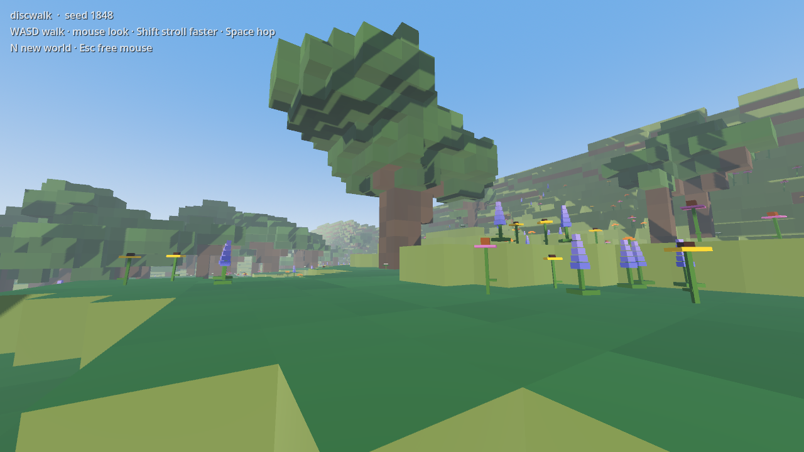
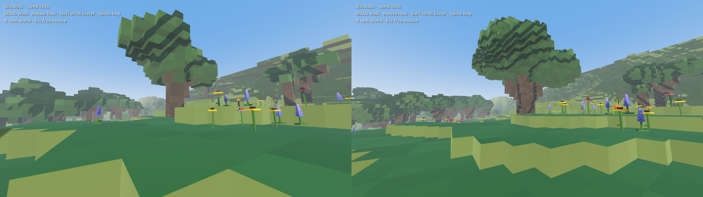
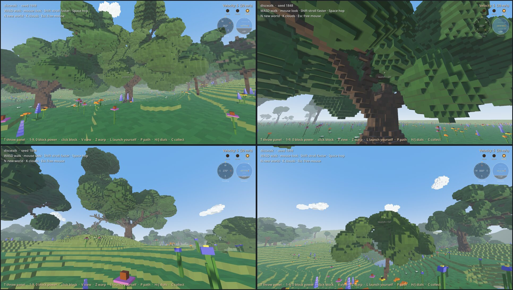
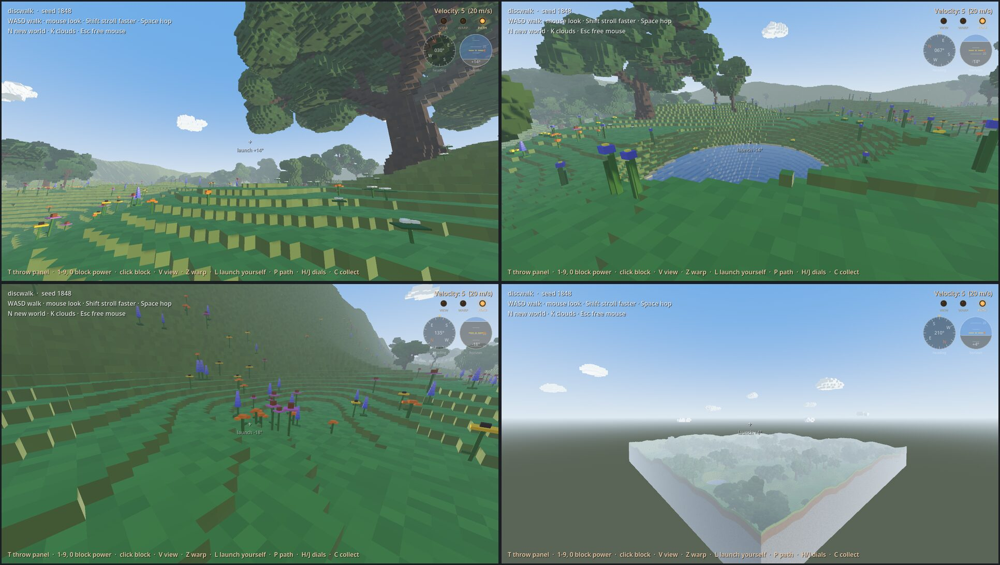
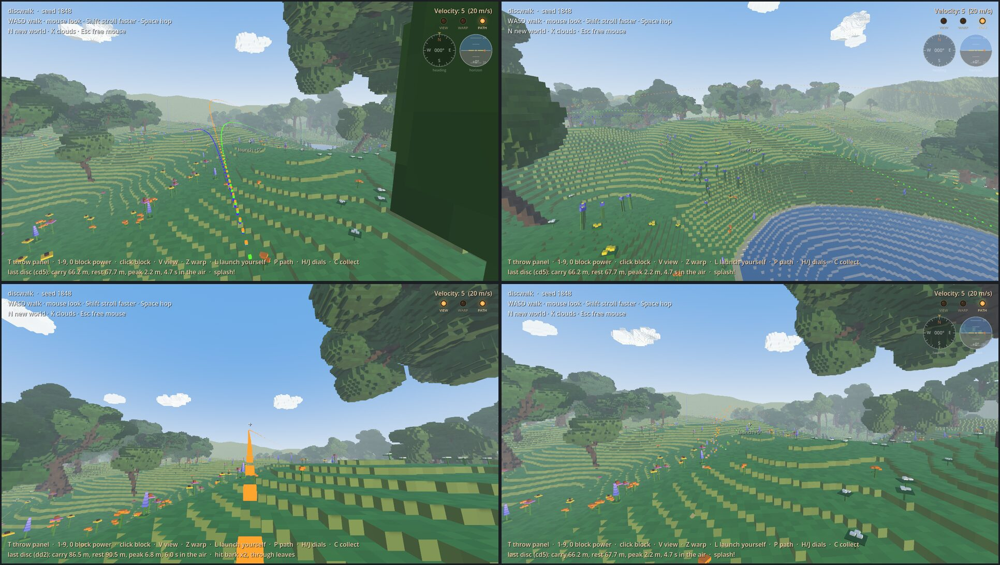
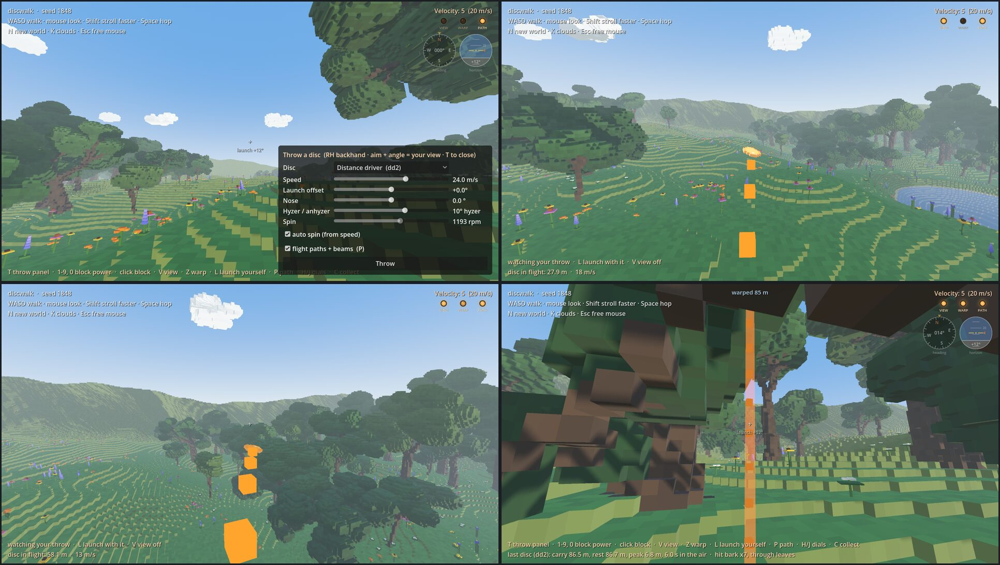

# discwalk

A voxel walking sim through a generated glacial landscape (kettle lakes, rolling till, a moraine at the world's edge), with disc golf eventually.

Built with **Godot 4.7** in plain GDScript. There are no native plugins or C#, so the same project runs on Linux, macOS and Windows.

Design + roadmap: Henon ticket `0002` (`zippychirps/tickets/0002-discwalk-voxel-godot-game.md`).

**Docs:** [Screenshots](#screenshots) · [Configuration](docs/CONFIG.md) · [Architecture](docs/ARCHITECTURE.md) · [Development](docs/DEVELOPMENT.md) · [Disc flight plan](docs/DISC-FLIGHT-PLAN.md)



## Quick start

1. Get the code: `git clone https://github.com/ghukill/discwalk.git`
2. Install Godot 4.7.x (standard build, not .NET): <https://godotengine.org/download>
   - **macOS:** download, unzip, drag `Godot.app` to Applications.
   - **Linux:** download and unzip; it's a single executable (on the T480 it's already at `../tools/godot/Godot_v4.7.2-stable_linux.x86_64`).
3. Open Godot → **Import** → pick `discwalk/project.godot` → **Run** (F5). The first open takes a moment while Godot imports assets, and each world takes a little while to generate (see [Block size](#block-size-performance)).

Or from a terminal:

```sh
# macOS
/Applications/Godot.app/Contents/MacOS/Godot --path /path/to/discwalk
# Linux (from inside the repo)
/path/to/Godot_v4.7.2-stable_linux.x86_64 --path .
```

### Controls

| Key | Action |
|---|---|
| WASD / arrows | walk |
| Mouse | look |
| Shift | stroll faster |
| Space | hop |
| T | **throw panel** (lower right): pick a disc, set speed, launch offset, nose, hyzer/anhyzer and spin, press **Throw**. A real flying disc leaves where you're looking, left/right **and up/down** (right-hand backhand); the launch offset (0° by default) tilts it above or below your view. `launch +12°` under the crosshair shows the angle you'd throw at. T again closes it |
| H / J | heading (compass) / horizon (attitude) dials on or off, top right. The orange chevron on the horizon dial is your launch angle (view + offset) |
| 1–9, 0 | set block power 1–10 (0 = 10), shown top-right as `Velocity: #` |
| Left click | fire an orange **block** at the current power (the original cannon, kept for fun) |
| V | **VIEW toggle** (warm lamp top right, starts off): the camera chases every throw (disc or block) through its flight and ground play, then snaps back to you, unmoved, once it fully stops. Off mid-flight snaps back now |
| Z | **WARP toggle** (lamp, starts off): once every throw fully stops, you're moved to it, standing just behind it facing down the fairway (a lake puts you on the shore). Off mid-flight cancels that warp. **VIEW + WARP**: watch the flight, then end up there |
| L | **launch yourself** (one-shot): while your last throw is still moving (flying, skipping or rolling), you take on its position and velocity and fly on with it until you land. For that throw only, VIEW and WARP stand down. Does nothing once it has stopped |
| P | **PATH toggle** (lamp, starts on; also a checkbox in the throw panel): flight paths *and* the beams over resting discs. On: every disc throw leaves a trail of little cubes in its own colour (bright in the air, smaller and dimmer for skips and rolls). Off: the beams go out, the paths drift down and go *poof*, and new throws leave none until P again |
| C | **collect**: every disc rolls home to you, slow at first and then faster and faster. Trunks and cliffs block them unless they have the momentum |
| N | roll a brand-new world |
| K | clouds on/off (launch with `-- --no-clouds` to start without them) |
| Esc | free the mouse (click to grab it again) |

### Block size (performance)

The default voxel size is **0.25 m**: a fine, detailed world, which is what the screenshots below show. It's also the heaviest: a world takes ~11 s to build on an M1 Mac and about a minute on an older laptop like the T480, and needs ~1.7 GB of memory (pressing **N** for a new world rebuilds at the same size).

If it's slow to build or the frame rate suffers, launch with bigger blocks. You get the same landscape, just chunkier:

```sh
/Applications/Godot.app/Contents/MacOS/Godot --path /path/to/discwalk -- --block-size=0.5   # ~4x lighter
/Applications/Godot.app/Contents/MacOS/Godot --path /path/to/discwalk -- --block-size=1     # the original chunky look, ~5 s even on the T480
```



See [docs/CONFIG.md](docs/CONFIG.md#block-size) for every knob and the cost trade-offs.

## Screenshots

All shot at the default 0.25 m blocks with the `tools/*_shots.gd` scripts (see [Development](docs/DEVELOPMENT.md)).

**Oaks:** a grove, the view up from under a giant, a lone spreading oak on a rise, a leaning oak in the meadow.



**The world:** clouds over spawn, a kettle lake, a wildflower hollow, the whole world from above.



**Flight paths:** three throws (hyzer, flat, anhyzer) from the tee and from the side, a beam over a resting disc, and paths falling after P.



**Throw panel, chase cam (V) and warp (Z):** setting up a throw, the camera chasing the disc, threading the trees, and warped to where it landed.



## How the world works

`scripts/terrain.gd` builds everything from one seed:

1. **Till plain:** two layers of simplex noise (hills + long drumlin-ish swells) make a height grid.
2. **Moraine:** the edge of the world rises into a ridge so it feels enclosed.
3. **Kettles:** a few round bowls are pressed into the ground (kept clear of spawn and of each other).
4. **Blocks:** heights snap to whole blocks (0.25 m by default, see `block_size`). Each 32 m chunk becomes one **greedy-meshed** mesh: only visible faces, with flat same-coloured stretches merged into big rectangles. Per-block colour variation is added in a shader.
5. **Lakes:** each kettle fills with water up to just below its lowest rim, with sandy shores and a muddy bed.
6. **Oaks** (`scripts/flora.gd`): each tree is grown from its own seed as a branching skeleton. A tapering trunk with a root flare carries spiralling limbs, and those recurse into side branches, forks and twigs, with a leaf cluster on every tip. Five forms: wide **spreading** lone oaks, **tall** grove oaks reaching for light, **forked**, **leaning**, and **saplings**. There are occasional bare dead limbs, and every tree mixes its own shade of green. Low-frequency noise splits the land into groves and open meadows (Michigan oak openings), with the odd giant lone oak out in a field. No trees in lakes, on shores, on steep ground, or at spawn. Trunks are solid and crowns are walk-through.
7. **Wildflowers:** little voxel plants, drawn with MultiMesh and swaying in a wind shader (`shaders/sway.gdshader`). The species depends on habitat: blue flag iris and marsh marigold by the water, trillium in oak shade, and patches of black-eyed Susan, purple coneflower, wild lupine and butterfly weed in the meadows.
8. **Collision:** a smooth heightmap runs through the block centres. One-block steps feel like gentle ramps, and cliffs of two or more blocks act as walls.

## Dev tools

```sh
G=../tools/godot/Godot_v4.7.2-stable_linux.x86_64
$G --headless --path . --script res://tools/smoke_test.gd      # world builds, walker lands: PASS/FAIL (0.25 m, ~1 min on the T480)
$G --headless --path . --script res://tools/smoke_test.gd -- --block-size=1   # same, quick (~5 s)
$G --path . --script res://tools/screenshot.gd -- /tmp/shots    # renders a few PNG views (needs a display)
```

More in [docs/DEVELOPMENT.md](docs/DEVELOPMENT.md).

## Roadmap

Done:
- [x] **1. Walker + generated voxel terrain + kettle lakes**
- [x] **2. Oaks + wildflowers**: branching oaks in 5 forms, habitat-based wildflowers with wind sway
- [x] **Configurable voxel size** (`--block-size`, 0.25 m by default) + docs
- [x] **Greedy meshing** (about 5× fewer triangles; 0.25 m blocks are comfortable)
- [x] **Disc throwing, step 1**: a block fired from you that bounces off ground and trunks, clatters through branches, gets swallowed by leaves, and floats in lakes. Power keys, fetch (ride a flying disc!), beam toggle, collect (discs roll home).
- [x] **Disc flight, step 2**: flat pixel discs with lift, drag and gyroscopic turn/fade (`disc_model.gd`), four disc tables, a lower-right throw panel (T). Checked against shotshaper (`tools/flight_test.gd`).
- [x] **Follow cam (V)**: chase camera behind the disc, hands back once it stops
- [x] **Flight paths**: voxel trail per throw, own colour, dimmer on the ground; P toggles; off = they fall and poof
- [x] **Aim with your view**: launch angle = view pitch + panel offset; heading + horizon dials (H/J)
- [x] **Landings**: Jolt physics (no more discs through the ground), slicker ground play so discs skip
- [x] **Clouds**: fluffy voxel clouds, a few low puffs just over the trees (K)
- [x] **Warp (Z)**: go to your disc once it stops, ready for the next shot
- [x] **Toggles + launch**: V (view) and Z (warp) are toggles with warm cockpit lamps top right, P covers paths + beams, L launches you with your last throw (replaces F fetch and B beams)

Next (pick any):
- [ ] **Menu** (Esc?): Resume, Help (screen of key bindings), New world, **Display** sub-menu (fullscreen toggle to start), Quit
- [ ] **Wind**: static vector to start (the flight model already subtracts it), maybe gusts; a wind arrow on the dials; drives cloud drift
- [ ] Throw panel rework (it freezes the view while open); forehand toggle. **Graham's idea (2026-10):** a little 3D disc you tilt by click-drag or arrow keys (up/down = nose, left/right = hyzer/anhyzer), a tall release-speed slider next to it, and a thinner spin slider (dimmed while auto-spin is locked to speed). Every input is a 2-axis tilt or a 1-axis slider, so it maps straight onto a controller later. Decided: arrows come off walking (WASD only) and tilt the disc; **hold T** = mouse tilts the disc, **scroll** = release speed, and the panel dropdown is usable while T is held; **Tab** cycles discs; the disc preview is a real 3D mesh seen from the thrower's side; the launch angle HUD stays (view pitch = launch angle, disc tilt = nose). **Sketch** ([docs/mockups/throw-hud-sketch.png](docs/mockups/throw-hud-sketch.png)): one lower-right HUD cluster with the disc in a circle (hand emoji = forehand/backhand), a velocity bar and a spin bar (dotted when locked), heading + horizon dials below, and labelled lamps Chase view (V), Goto (G, was Z warp), Paths (P). Mouse is always view/POV; launch offset goes away. **Keys (decided):** mouse = view only; arrows (off walking) = nose ↑↓ / hyzer-anhyzer ←→; Shift+↑↓ = velocity; Shift+←→ = spin when unlocked; Enter = throw disc; L = launch yourself with any projectile; orange cubes stay (fun + wind/physics testing); chase view + goto work for cubes and discs; **H** = backhand ↔ forehand (✋ sits right of the disc circle for backhand, left for forehand). H no longer toggles the heading dial
- [ ] More discs / our own coefficient tables (replace the GPL shotshaper ones, see `data/discs/README.md`)
- [ ] Picture-in-picture follow cam
- [ ] Discs resting in trees; baskets
- [ ] **Wind grass**: instanced voxel tufts, reusing the flower sway shader
- [ ] More tree variety (tuning, species, autumn)
- [ ] Auto-walk toggle (helps over VNC, where held keys arrive as taps)

Explore later:
- [ ] **Export + import worlds**: write a world to a file (seed + settings, plus anything hand-edited or placed, e.g. discs, baskets) and load it back. That's the foundation for **pre-made worlds** shipped as files you pick at startup, e.g. a **flat distance world**: long and narrow, no plants, no lakes, distance markings in the ground
- [ ] **Game controller support** (Graham has ideas): left stick walk, right stick look, triggers/buttons for throw, follow cam, paths, warp; the throw panel navigable with the d-pad
- [ ] **Disc golf mechanics**: baskets, holes/tees, stroke counting (warp is the first piece)
- [ ] **Single-file builds**: Godot export for Linux (one binary with the game data embedded) and macOS (a universal .app, zipped), built headless on the T480
- [ ] **Web build (WASM)**: Godot web export, single-threaded so it works on GitHub Pages/itch. Needs the Compatibility (WebGL2) renderer instead of Forward+ (check shadows, lakes, shaders), URL params instead of CLI flags (`?block=0.25&clouds=0`), a loading screen, probably 0.5 m blocks by default on the web, and a check that Jolt is in the web build
- [ ] **Distance throwing zone**: a field marked with distance lines in the ground, either near one edge of every world (e.g. the west edge) or, better, its own pre-made world (which opens the door to hand-made/pre-made worlds generally)
- [ ] Background/threaded tree building with a grow-in animation
- [ ] Bigger worlds; infinite streaming world (region-local lakes/trees, chunks built as you walk)
- [ ] Polish: day cycle, ambient sound
