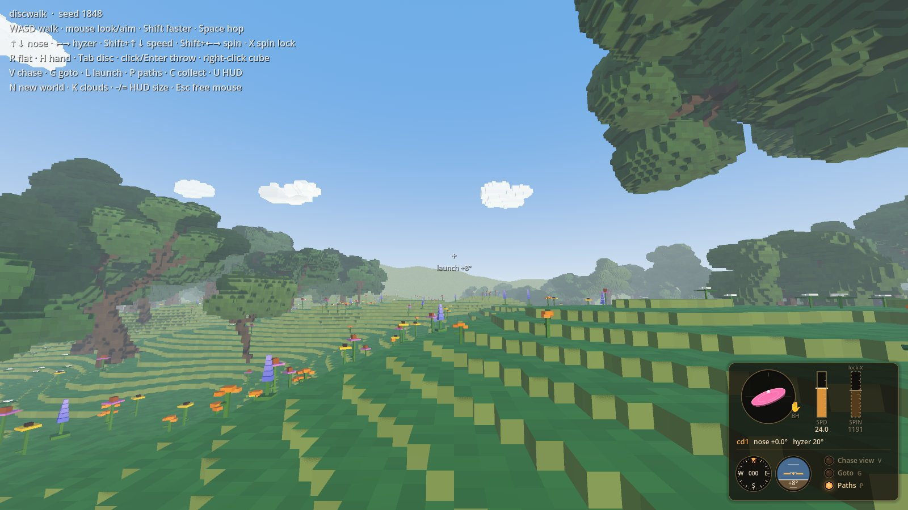

# discwalk

A voxel walking sim through a generated glacial landscape (kettle lakes, rolling till, a moraine at the world's edge), with disc golf eventually.

Built with **Godot 4.7** in plain GDScript. There are no native plugins or C#, so the same project runs on Linux, macOS and Windows.

Design + roadmap: Henon ticket `0002` (`zippychirps/tickets/0002-discwalk-voxel-godot-game.md`).

**Docs:** [Screenshots](#screenshots) · [Configuration](docs/CONFIG.md) · [Architecture](docs/ARCHITECTURE.md) · [Development](docs/DEVELOPMENT.md) · [Disc flight plan](docs/DISC-FLIGHT-PLAN.md)


## Quick start

1. Get the code: `git clone https://github.com/ghukill/discwalk.git`
2. Install Godot 4.7.x (standard build, not .NET): <https://godotengine.org/download>
   - **macOS:** download, unzip, drag `Godot.app` to Applications.
   - **Linux:** download and unzip; it's a single executable (on the T480 it's already at `../tools/godot/Godot_v4.7.2-stable_linux.x86_64`).
3. Open Godot → **Import** → pick `discwalk/project.godot` → **Run** (F5). The first open takes a moment while Godot imports assets, and each world takes a little while to generate (see [Block size](#block-size-performance)).

Or from a terminal:

```sh
# macOS
/Applications/Godot.app/Contents/MacOS/Godot --path /path/to/discwalk
# Linux (from inside the repo)
/path/to/Godot_v4.7.2-stable_linux.x86_64 --path .
```

### Controls

The mouse only ever looks. Where you look is where the disc goes, left/right **and** up/down: how high you look is your launch angle (`launch +8°` under the crosshair). The keyboard sets up the throw, and the **throw HUD** in the lower right shows it. Everything you set carries over from throw to throw, so you can repeat a shot and fine-tune it. Full spec: [docs/THROW-HUD.md](docs/THROW-HUD.md).



**Walk and look**

| Key | Action |
|---|---|
| WASD | walk (the arrows don't walk any more) |
| Mouse | look and aim |
| Shift | stroll faster |
| Space | hop |

**Set up the throw**

| Key | Action |
|---|---|
| ↑ / ↓ | nose up / down |
| ← / → | tilt the disc: the edge on that side drops. Backhand: ← = hyzer, → = anhyzer (forehand is mirrored) |
| Shift + ↑ / ↓ | release speed (discs **and** cubes) |
| Shift + ← / → | spin, when unlocked |
| X | spin lock / unlock. Locked (dotted bar) = spin follows speed, like a real throw |
| R | reset to flat (nose 0, hyzer 0) |
| H | backhand ↔ forehand. The ✋ sits right of the disc for backhand, left for forehand |
| Tab / Shift+Tab | next / previous disc |

A tap moves one fine step (0.5° nose, 1° hyzer, 0.5 m/s, 2 rad/s spin); hold to sweep, faster the longer you hold.

**Throw**

| Key | Action |
|---|---|
| Left click / Enter | throw the disc |
| Right click | throw an orange **cube** at the same speed (the original cannon, kept for fun and for testing physics) |
| L | **launch yourself** (one-shot): while your last throw (disc or cube) is still moving, you take on its position and velocity and fly on with it until you land. Chase and goto stand down for that throw. Does nothing once it has stopped |

**Lamps and the rest**

| Key | Action |
|---|---|
| V | **Chase view** lamp (starts off): the camera chases every throw through its flight and ground play, then snaps back to you, unmoved, once it stops. Off mid-flight snaps back now |
| G | **Goto** lamp (starts off): once a throw stops, you're moved to it, standing just behind it facing down the fairway (a lake puts you on the shore). Off mid-flight cancels it. **Chase + Goto**: watch the flight, then end up there |
| P | **Paths** lamp (starts on): flight paths *and* the beams over resting discs. Every disc throw leaves a trail of little cubes in its own colour (bright in the air, dimmer for skips and rolls). Off: beams go out, paths drift down and go *poof* |
| C | **collect**: every disc rolls home to you, slow at first then faster. Trunks and cliffs block them unless they have the momentum |
| U | hide / show the throw HUD and the help text (screenshots, or just walking in the woods) |
| - / = | HUD smaller / bigger (also `-- --ui-scale=1.5` at launch) |
| N | roll a brand-new world |
| K | clouds on/off (launch with `-- --no-clouds` to start without them) |
| Esc | free the mouse (click to grab it again) |

The HUD grows with the window (1× up to 900 px tall, then in proportion), so fullscreen on a big or Retina screen stays readable. If it's still small or too big, - / = adjust it.

### Block size (performance)

The default voxel size is **0.25 m**: a fine, detailed world, which is what the screenshots below show. It's also the heaviest: a world takes ~11 s to build on an M1 Mac and about a minute on an older laptop like the T480, and needs ~1.7 GB of memory (pressing **N** for a new world rebuilds at the same size).

If it's slow to build or the frame rate suffers, launch with bigger blocks. You get the same landscape, just chunkier:

```sh
/Applications/Godot.app/Contents/MacOS/Godot --path /path/to/discwalk -- --block-size=0.5   # ~4x lighter
/Applications/Godot.app/Contents/MacOS/Godot --path /path/to/discwalk -- --block-size=1     # the original chunky look, ~5 s even on the T480
```


See [docs/CONFIG.md](docs/CONFIG.md#block-size) for every knob and the cost trade-offs.

## Screenshots

All shot at the default 0.25 m blocks with the `tools/*_shots.gd` scripts (see [Development](docs/DEVELOPMENT.md)).

**Oaks:** a grove, the view up from under a giant, a lone spreading oak on a rise, a leaning oak in the meadow.


**The world:** clouds over spawn, a kettle lake, a wildflower hollow, the whole world from above.


**Flight paths:** three throws (hyzer, flat, anhyzer) from the tee and from the side, a beam over a resting disc, and paths falling after P.


**Throw HUD:** flat, hyzer, nose up with spin unlocked, a forehand anhyzer (✋ on the left), and a steep hyzer. Each disc has its own colour in the HUD.


**Chase view (V) and goto (G):** setting up a throw (with the old panel), the camera chasing the disc, threading the trees, and moved to where it landed.


## How the world works

`scripts/terrain.gd` builds everything from one seed:

1. **Till plain:** two layers of simplex noise (hills + long drumlin-ish swells) make a height grid.
2. **Moraine:** the edge of the world rises into a ridge so it feels enclosed.
3. **Kettles:** a few round bowls are pressed into the ground (kept clear of spawn and of each other).
4. **Blocks:** heights snap to whole blocks (0.25 m by default, see `block_size`). Each 32 m chunk becomes one **greedy-meshed** mesh: only visible faces, with flat same-coloured stretches merged into big rectangles. Per-block colour variation is added in a shader.
5. **Lakes:** each kettle fills with water up to just below its lowest rim, with sandy shores and a muddy bed.
6. **Oaks** (`scripts/flora.gd`): each tree is grown from its own seed as a branching skeleton. A tapering trunk with a root flare carries spiralling limbs, and those recurse into side branches, forks and twigs, with a leaf cluster on every tip. Five forms: wide **spreading** lone oaks, **tall** grove oaks reaching for light, **forked**, **leaning**, and **saplings**. There are occasional bare dead limbs, and every tree mixes its own shade of green. Low-frequency noise splits the land into groves and open meadows (Michigan oak openings), with the odd giant lone oak out in a field. No trees in lakes, on shores, on steep ground, or at spawn. Trunks are solid and crowns are walk-through.
7. **Wildflowers:** little voxel plants, drawn with MultiMesh and swaying in a wind shader (`shaders/sway.gdshader`). The species depends on habitat: blue flag iris and marsh marigold by the water, trillium in oak shade, and patches of black-eyed Susan, purple coneflower, wild lupine and butterfly weed in the meadows.
8. **Collision:** a smooth heightmap runs through the block centres. One-block steps feel like gentle ramps, and cliffs of two or more blocks act as walls.

## Dev tools

```sh
G=../tools/godot/Godot_v4.7.2-stable_linux.x86_64
$G --headless --path . --script res://tools/smoke_test.gd      # world builds, walker lands: PASS/FAIL (0.25 m, ~1 min on the T480)
$G --headless --path . --script res://tools/smoke_test.gd -- --block-size=1   # same, quick (~5 s)
$G --path . --script res://tools/screenshot.gd -- /tmp/shots    # renders a few PNG views (needs a display)
```

More in [docs/DEVELOPMENT.md](docs/DEVELOPMENT.md).

## Roadmap

Done:
- [x] **1. Walker + generated voxel terrain + kettle lakes**
- [x] **2. Oaks + wildflowers**: branching oaks in 5 forms, habitat-based wildflowers with wind sway
- [x] **Configurable voxel size** (`--block-size`, 0.25 m by default) + docs
- [x] **Greedy meshing** (about 5× fewer triangles; 0.25 m blocks are comfortable)
- [x] **Disc throwing, step 1**: a block fired from you that bounces off ground and trunks, clatters through branches, gets swallowed by leaves, and floats in lakes. Power keys, fetch (ride a flying disc!), beam toggle, collect (discs roll home).
- [x] **Disc flight, step 2**: flat pixel discs with lift, drag and gyroscopic turn/fade (`disc_model.gd`), four disc tables, a lower-right throw panel (T). Checked against shotshaper (`tools/flight_test.gd`).
- [x] **Follow cam (V)**: chase camera behind the disc, hands back once it stops
- [x] **Flight paths**: voxel trail per throw, own colour, dimmer on the ground; P toggles; off = they fall and poof
- [x] **Aim with your view**: launch angle = view pitch + panel offset; heading + horizon dials (H/J)
- [x] **Landings**: Jolt physics (no more discs through the ground), slicker ground play so discs skip
- [x] **Clouds**: fluffy voxel clouds, a few low puffs just over the trees (K)
- [x] **Warp (Z)**: go to your disc once it stops, ready for the next shot
- [x] **Toggles + launch**: V (view) and Z (warp) are toggles with warm cockpit lamps top right, P covers paths + beams, L launches you with your last throw (replaces F fetch and B beams)
- [x] **Throw HUD** ([spec](docs/THROW-HUD.md)): the T panel is gone. A small warm cockpit block in the lower right shows a tilting 3D disc, ✋ for backhand/forehand, speed + spin bars, heading + horizon dials and the Chase view / Goto / Paths lamps. Arrows tilt, Shift+arrows speed/spin, X spin lock, R flat, H hand, Tab discs, click/Enter throw, right click cube, G goto (was Z), U hides the HUD, -/= resize it. Launch offset removed: the view is the launch angle

Next (pick any):
- [ ] **Menu** (Esc?): Resume, Help (screen of key bindings), New world, **Display** sub-menu (fullscreen toggle to start), Quit
- [ ] **Wind**: static vector to start (the flight model already subtracts it), maybe gusts; a wind arrow on the dials; drives cloud drift
- [ ] Throw HUD follow-ups: a better nose display (try it, iterate), a mouse-drag option, controller mapping
- [ ] More discs / our own coefficient tables (replace the GPL shotshaper ones, see `data/discs/README.md`)
- [ ] Picture-in-picture follow cam
- [ ] Discs resting in trees; baskets
- [ ] **Wind grass**: instanced voxel tufts, reusing the flower sway shader
- [ ] More tree variety (tuning, species, autumn)
- [ ] Auto-walk toggle (helps over VNC, where held keys arrive as taps)

Explore later:
- [ ] **Export + import worlds**: write a world to a file (seed + settings, plus anything hand-edited or placed, e.g. discs, baskets) and load it back. That's the foundation for **pre-made worlds** shipped as files you pick at startup, e.g. a **flat distance world**: long and narrow, no plants, no lakes, distance markings in the ground
- [ ] **Game controller support** (Graham has ideas): left stick walk, right stick look, triggers/buttons for throw, chase, paths, goto; d-pad for tilt, shoulder buttons for speed (the throw HUD keys map straight across)
- [ ] **Disc golf mechanics**: baskets, holes/tees, stroke counting (warp is the first piece)
- [ ] **Single-file builds**: Godot export for Linux (one binary with the game data embedded) and macOS (a universal .app, zipped), built headless on the T480
- [ ] **Web build (WASM)**: Godot web export, single-threaded so it works on GitHub Pages/itch. Needs the Compatibility (WebGL2) renderer instead of Forward+ (check shadows, lakes, shaders), URL params instead of CLI flags (`?block=0.25&clouds=0`), a loading screen, probably 0.5 m blocks by default on the web, and a check that Jolt is in the web build
- [ ] **Distance throwing zone**: a field marked with distance lines in the ground, either near one edge of every world (e.g. the west edge) or, better, its own pre-made world (which opens the door to hand-made/pre-made worlds generally)
- [ ] Background/threaded tree building with a grow-in animation
- [ ] Bigger worlds; infinite streaming world (region-local lakes/trees, chunks built as you walk)
- [ ] Polish: day cycle, ambient sound
