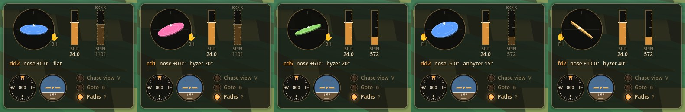

# Throw HUD rework (spec)

> **Status:** built (Oct 2026). Sketch: [mockups/throw-hud-sketch.png](mockups/throw-hud-sketch.png).
> Replaces the T throw panel. Controllers are out of scope for now.
> Code: `scripts/throw_setup.gd` (state + keys), `scripts/throw_hud.gd` (drawing), `scripts/dials.gd`, `scripts/lamps.gd`. Test: `tools/hud_test.gd`.

## HUD (one block, lower right)

- **Disc circle**: the disc drawn from slightly behind and above. Left/right tilt shows hyzer/anhyzer. Nose up opens the ellipse (drawn 1.8× steeper), and a dot marks the leading edge; the status line under it reads `nose +3.0°  hyzer 20°` (first try, iterate). Each disc has its own HUD colour.
- **✋ hand**: right of the circle = backhand, left = forehand.
- **Velocity bar** (left of the pair) and **spin bar** (right). Spin is dotted/dimmed and can't be changed while it's locked (auto spin from speed).
- **Heading dial** and **horizon dial** below. They always show; the horizon chevron = launch angle (= view pitch, no offset).
- **Lamps**: Chase view (V), Goto (G), Paths (P).
- `launch +N°` stays under the crosshair.

## Keys

| Key | Action |
|---|---|
| WASD | walk (arrows no longer walk) |
| Mouse | look, always. Aim = where you look; view pitch is the launch angle |
| Shift | stroll faster |
| Space | hop |
| ↑ / ↓ | nose up / down |
| ← / → | tilt: the edge on that side drops (backhand ← = hyzer; forehand mirrored) |
| Shift + ↑ / ↓ | velocity |
| Shift + ← / → | spin (only when unlocked) |
| X | spin lock / unlock |
| R | reset disc to flat (nose 0, hyzer 0) |
| H | backhand ↔ forehand |
| Tab / Shift+Tab | next / previous disc |
| Left click / Enter | throw disc |
| Right click | throw orange cube (at the disc speed) |
| L | launch yourself with your last throw (disc or cube) |
| V | chase view toggle (discs + cubes) |
| G | goto toggle (was Z warp; discs + cubes) |
| P | paths + beams toggle |
| U | hide / show the whole HUD (and the help text) |
| - / = | HUD smaller / bigger (`--ui-scale=` at launch) |
| C | collect |
| N | new world |
| K | clouds |
| Esc | free the mouse |

Removed: T (panel), J (horizon dial toggle), Z (now G), 1–0 cube power (cubes use the speed bar), launch offset, arrows-walk.

Everything carries over from throw to throw (practice!); R resets the tilt only.

## Size

The overlay is drawn 1× up to a 900 px tall window, then scaled in proportion (fullscreen 1800 px tall = 2×), times your own `- / =` adjustment. Err small, grow it if needed.

Tap vs hold on arrows: a tap nudges a fine step (0.5° nose, 1° hyzer, 0.5 m/s, a few rad/s spin); holding ramps up.
